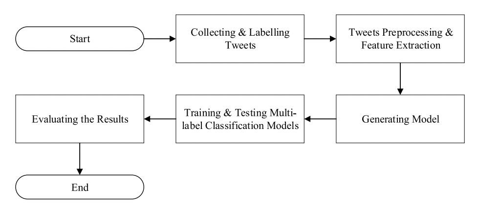

# Multilevel Textual Emotion Classification

Multi-Label Textual Emotion Classification in Social Media Contents using Machine Learning Algorithms implemented with python.

# Description

In this project, we have classified emotions from texts. Emotions considered in this work are Joy, Sadness, Anger, Disgust, Admiration, Surprise, Interest, Fear. We have collected our text data from twitter. We have used two algorithm adaptations methods to work with multiple labels. One is Multi-label K nearest neighbors (MLkNN) and another one combines approaches from both Binary Relevance and K-Nearest neighbor (BRkNN).

## MLkNN

* Adapts K nearest neighbor algorithm to work with multiple labels
* Uses Maximum a posteriori (MAP) principal to determine labels for unidentified data
* MAP is based on the information from nearest neighbors

## BRkNN

* Combines approaches from binary relevance and k nearest neighbors 
* Has two extensions BRkNN-a & BRkNN-b
* BRkNN-a outputs labels present in half of the nearest neighbors
* BRkNN-b outputs first k labels with highest confidence value, where k is label density rounded to nearest integer

# Outline of Methodology

# Multi-Label Emotion Classifier Framework

# Dataset Description 

* Tweets selected from Sentiment140 dataset
* Tweets were labeled according to emotions (Joy, Sadness, Anger, Disgust, Admiration, Surprise, Interest, Fear)
* Total number of tweets 8501
* Label Cardinality 1.5
* Label Density 0.1875

## Emotion Distribution in the dataset

| Emotion      | No. of Tweets |
| ----------- | ----------- |
| Joy     | 2406    |
| Sadness  | 4126     |
| Anger    | 989   |
| Disgust  | 1380    |
| Admiration   | 578    |
| Surprise  | 624     |
| Interest   | 2134   |
| Fear  | 674    |

# Experimental Results

| Evaluation Metric      | MLkNN | BRkNN-a | BRkNN-b |
| ----------- | ----------- | ------ | ------ |
|  Hamming Loss |  0.169   | 0.17 | 0.255 |
|  0/1 Subset Loss |  0.202   | 0.169 | 0.094 |
|  Macro F-Score |  0.887   | 0.891 | 0.821 |
|  Mircro F-Score |  0.901   | 0.902 | 0.843 |
|  Average Accuracy |  0.83   | 0.829 | 0.744 |

# Software Requirements

The software environment used to execute the system is given below:

* Microsoft Windows 10 (OS Build 19042.928)
* python => 3.8.5
* anaconda => 2020.11
* pip => 20.2.4
* jupyter => 1.0.0
* numpy => 1.19.2
* pandas => 1.1.3
* matplotlib => 3.3.2
* nltk => 3.5
* scikit-learn => 0.23.2
* scikit-multilearn => 0.2.0

Although the system was run in an windows environment, with the proper packages present, this can be run in other operating systems too. The dependencies
of the given packages are also needed to be installed for this to work properly.
All the packages aren’t needed at once to run the system.

